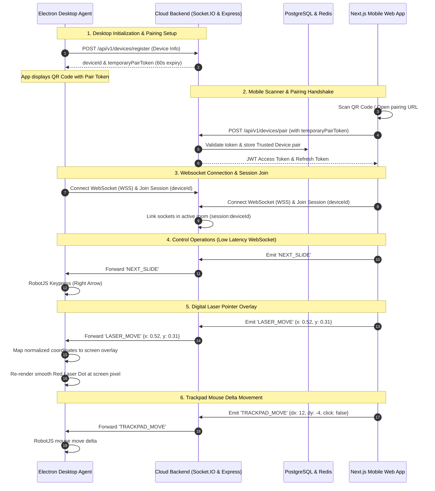

# Implementation Plan - Production-Quality Presentation Remote Platform

This implementation plan details the full architecture, components, schemas, protocols, and step-by-step roadmap to build **Presenter**, a globally accessible presentation remote platform. 

The system enables users to control desktop slideshows (PowerPoint, Google Slides, Canva, etc.) using a mobile web browser over the internet with low latency. It includes a **Cloud Backend** (Node.js, Express, Socket.IO, Redis, PostgreSQL), a **Desktop Agent** (Electron, RobotJS, TypeScript), and a **Mobile Web App** (Next.js, Tailwind CSS, PWA).

---

## Architecture Overview



---

## User Review Required

> [!IMPORTANT]
> **Compilation of RobotJS on Windows / Electron Rebuild:**
> Native node modules like `robotjs` compile against the target system's Node ABI. When bundled with Electron, we must rebuild `robotjs` to match Electron's internal Node version using `electron-rebuild`. Since the desktop agent runs on Windows, the system must have Visual Studio Build Tools (C++ compiler) and Python installed for the local build.
> *Proposed Solution:* We will implement a robust fallback overlay or clean OS-level abstraction. If `robotjs` compilation fails or is unavailable in a particular runtime, our code will gracefully switch to a PowerShell-based mouse/keyboard virtual injector or display a warning rather than crashing.

> [!WARNING]
> **Redis & Session Scale:**
> To scale horizontally across multiple cloud instances, Socket.IO uses `@socket.io/redis-adapter` for pub/sub. Redis is required. In the Docker compose file and local templates, we will configure a local Redis service, which is essential to match production.

---

## Open Questions

> [!NOTE]
> 1. **Laser Pointer Overlay Performance:**
>    Should we implement the laser pointer as a transparent, click-through, always-on-top fullscreen Electron window overlay? Yes. To keep performance high and CPU usage low, we will optimize window composition and use CSS transforms on a single high-performance canvas inside the overlay window.
>
> 2. **Auto-Launch Preference:**
>    Should the Electron app launch minimized in the tray by default on Windows? We plan to implement `electron-to-key` auto-launch using the `auto-launch` npm package and default it to starting in the tray with user option toggles.

---

## Proposed Changes

We will establish a modern **Monorepo** structure inside the `Presenter` directory.

### Monorepo Folder Structure

```
Presenter/
├── package.json                   # Root package.json (workspace configurations)
├── tsconfig.json                  # Base TypeScript settings
├── docker-compose.yml             # Docker infrastructure (pg, redis, backend, nginx)
├── .env.example                   # Global example env variables
├── README.md                      # Professional Readme file
├── apps/
│   ├── backend/                   # Node.js/Express + Socket.IO Server
│   │   ├── Dockerfile
│   │   ├── package.json
│   │   ├── tsconfig.json
│   │   ├── src/
│   │   │   ├── config/            # db, redis, env configs
│   │   │   ├── controllers/       # auth, device, session controllers
│   │   │   ├── middleware/        # rate limiting, jwt, error handler
│   │   │   ├── models/            # postgres database client / raw queries
│   │   │   ├── routes/            # express api routes (v1)
│   │   │   ├── services/          # authentication, pairing tokens, session manager
│   │   │   ├── sockets/           # Socket.IO handlers, pub/sub adapters
│   │   │   └── server.ts          # entry point
│   ├── desktop-agent/             # Electron + TypeScript + RobotJS app
│   │   ├── package.json
│   │   ├── tsconfig.json
│   │   ├── webpack.config.js       # or electron-builder configuration
│   │   ├── src/
│   │   │   ├── main/              # electron main process (tray, shortcuts, windows)
│   │   │   │   ├── index.ts
│   │   │   │   ├── injector.ts    # OS input injection abstraction (RobotJS / Fallbacks)
│   │   │   │   ├── overlay.ts     # transparent fullscreen laser overlay controller
│   │   │   │   └── tray.ts        # system tray management
│   │   │   ├── preload/           # context bridge preload scripts
│   │   │   │   └── index.ts
│   │   │   └── renderer/          # electron renderer UI (QR pairing, connection status)
│   │   │       ├── index.html
│   │   │       ├── styles.css
│   │   │       └── index.ts
│   └── mobile-web/                # Next.js 14 Web App
│       ├── Dockerfile
│       ├── package.json
│       ├── tailwind.config.js
│       ├── next.config.js
│       ├── src/
│       │   ├── app/               # App Router pages (auth, control, settings)
│       │   ├── components/        # SlideControls, Trackpad, LaserPointer, ConnectionStatus
│       │   ├── hooks/             # useSocket, useHaptic, useSession
│       │   └── utils/             # api client, storage, coordinate interpolators
```

---

## Database Schema (PostgreSQL)

We will use the following production-grade PostgreSQL schema to store persistent data for users, devices, trusted pairings, active sessions, active websocket connections, and audit trails.

```sql
-- Enable UUID extension if not enabled
CREATE EXTENSION IF NOT EXISTS "uuid-ossp";

-- 1. Users Table
CREATE TABLE IF NOT EXISTS users (
    id UUID PRIMARY KEY DEFAULT uuid_generate_v4(),
    email VARCHAR(255) UNIQUE NOT NULL,
    password_hash VARCHAR(255) NOT NULL,
    first_name VARCHAR(100),
    last_name VARCHAR(100),
    created_at TIMESTAMP WITH TIME ZONE DEFAULT CURRENT_TIMESTAMP,
    updated_at TIMESTAMP WITH TIME ZONE DEFAULT CURRENT_TIMESTAMP
);

-- 2. Devices Table (Both Mobile & Desktop Agents)
CREATE TABLE IF NOT EXISTS devices (
    id UUID PRIMARY KEY DEFAULT uuid_generate_v4(),
    user_id UUID REFERENCES users(id) ON DELETE CASCADE,
    device_uid VARCHAR(255) UNIQUE NOT NULL, -- Hardware UUID or custom generated unique id
    device_name VARCHAR(100) NOT NULL,
    device_type VARCHAR(50) NOT NULL, -- 'desktop', 'mobile'
    os_name VARCHAR(50),
    os_version VARCHAR(50),
    push_token VARCHAR(255),
    created_at TIMESTAMP WITH TIME ZONE DEFAULT CURRENT_TIMESTAMP,
    updated_at TIMESTAMP WITH TIME ZONE DEFAULT CURRENT_TIMESTAMP
);

-- 3. Trusted Pairs (Secure persistent relationship between Mobile & Desktop)
CREATE TABLE IF NOT EXISTS trusted_pairs (
    id UUID PRIMARY KEY DEFAULT uuid_generate_v4(),
    desktop_device_id UUID REFERENCES devices(id) ON DELETE CASCADE,
    mobile_device_id UUID REFERENCES devices(id) ON DELETE CASCADE,
    pair_name VARCHAR(100) DEFAULT 'Trusted Mobile Remote',
    auth_secret VARCHAR(255) NOT NULL, -- Shared AES key or signature key for pairing verification
    is_active BOOLEAN DEFAULT TRUE,
    created_at TIMESTAMP WITH TIME ZONE DEFAULT CURRENT_TIMESTAMP,
    last_used_at TIMESTAMP WITH TIME ZONE DEFAULT CURRENT_TIMESTAMP,
    CONSTRAINT unique_desktop_mobile_pair UNIQUE(desktop_device_id, mobile_device_id)
);

-- 4. Sessions (Presentation / Control Sessions)
CREATE TABLE IF NOT EXISTS sessions (
    id UUID PRIMARY KEY DEFAULT uuid_generate_v4(),
    desktop_device_id UUID REFERENCES devices(id) ON DELETE CASCADE,
    session_token VARCHAR(255) UNIQUE NOT NULL,
    is_active BOOLEAN DEFAULT TRUE,
    started_at TIMESTAMP WITH TIME ZONE DEFAULT CURRENT_TIMESTAMP,
    ended_at TIMESTAMP WITH TIME ZONE
);

-- 5. Active WebSocket Connections (Presence & Horizontal Scaling Routing Map)
CREATE TABLE IF NOT EXISTS websocket_connections (
    id UUID PRIMARY KEY DEFAULT uuid_generate_v4(),
    socket_id VARCHAR(100) UNIQUE NOT NULL,
    device_id UUID REFERENCES devices(id) ON DELETE CASCADE,
    server_node_id VARCHAR(100) NOT NULL, -- Node ID serving this socket
    connected_at TIMESTAMP WITH TIME ZONE DEFAULT CURRENT_TIMESTAMP,
    last_ping_at TIMESTAMP WITH TIME ZONE DEFAULT CURRENT_TIMESTAMP
);

-- 6. Audit Logs (Security Tracking)
CREATE TABLE IF NOT EXISTS audit_logs (
    id UUID PRIMARY KEY DEFAULT uuid_generate_v4(),
    user_id UUID REFERENCES users(id) ON DELETE SET NULL,
    event_type VARCHAR(100) NOT NULL, -- 'PAIR_REQUEST', 'DEVICE_REVOKED', 'AUTH_FAILURE'
    ip_address VARCHAR(45),
    user_agent VARCHAR(255),
    payload JSONB,
    created_at TIMESTAMP WITH TIME ZONE DEFAULT CURRENT_TIMESTAMP
);

-- Indexes for performance
CREATE INDEX IF NOT EXISTS idx_devices_user ON devices(user_id);
CREATE INDEX IF NOT EXISTS idx_trusted_pairs_desktop ON trusted_pairs(desktop_device_id);
CREATE INDEX IF NOT EXISTS idx_trusted_pairs_mobile ON trusted_pairs(mobile_device_id);
CREATE INDEX IF NOT EXISTS idx_sessions_active ON sessions(is_active);
CREATE INDEX IF NOT EXISTS idx_ws_device ON websocket_connections(device_id);
```

---

## Realtime API & WebSocket Events

We will use **Socket.IO** with custom namespaces/rooms. The server acts as a low-latency packet forwarder between a paired Mobile Browser and Desktop Agent.

### Event Definitions

| Event Name | Source | Target | Payload Structure | Description |
|---|---|---|---|---|
| `SESSION_JOIN` | Mobile / Desktop | Server | `{ deviceId: string, token: string }` | Client registers with room corresponding to pairing |
| `SESSION_JOINED` | Server | Mobile / Desktop | `{ sessionId: string, peersCount: number }` | Successful connection confirmation |
| `PEER_PRESENCE` | Server | Mobile / Desktop | `{ peerId: string, status: 'online' \| 'offline' }` | Notify other peers of connection changes |
| `NEXT_SLIDE` | Mobile | Desktop | `{}` | Trigger next slide control |
| `PREVIOUS_SLIDE`| Mobile | Desktop | `{}` | Trigger previous slide control |
| `START_SLIDESHOW`| Mobile | Desktop | `{}` | F5 key injection |
| `END_SLIDESHOW` | Mobile | Desktop | `{}` | Escape key injection |
| `BLACK_SCREEN` | Mobile | Desktop | `{}` | Inject 'B' key (black screen toggle) |
| `LASER_MOVE` | Mobile | Desktop | `{ x: number, y: number, visible: boolean }` | Absolute coords normalized [0, 1] |
| `TRACKPAD_MOVE` | Mobile | Desktop | `{ dx: number, dy: number }` | Relative delta displacement |
| `LEFT_CLICK` | Mobile | Desktop | `{}` | Simulate mouse left button click |
| `RIGHT_CLICK` | Mobile | Desktop | `{}` | Simulate mouse right button click |
| `HEARTBEAT` | Mobile / Desktop | Server | `{ clientTime: number }` | Ping-pong to track quality of connection |
| `HEARTBEAT_ACK` | Server | Mobile / Desktop | `{ clientTime: number, serverTime: number }` | Server response to ping |

---

## Express API Routes (Backend REST API)

All endpoints will be versioned under `/api/v1`.

### 1. Authentication (`/api/v1/auth`)
* `POST /register`: Register a new presentation user.
* `POST /login`: Authenticate user and receive JWT & Refresh tokens.
* `POST /refresh`: Refresh expired access token using HTTP-only cookies.
* `POST /logout`: Blacklist token and invalidate active sessions.

### 2. Device Management (`/api/v1/devices`)
* `POST /register`: Desktop Agent registers machine name/OS to obtain `deviceId` & secret key.
* `POST /pair/request`: Desktop requests a 60-second valid short token `temporaryPairToken` to display as QR.
* `POST /pair/verify`: Mobile scans and submits the `temporaryPairToken` to authorize trust link.
* `GET /list`: Retrieve list of active, paired, and trusted remotes.
* `DELETE /:deviceId`: Revoke trusted pair of remote device.

---

## Security Architecture

* **Rate Limiting:** Protect Express APIs (especially `/register`, `/login`, `/pair/verify`) from brute-force using `express-rate-limit` with Redis storage backend.
* **JWT Expiration:** Access tokens valid for 15 minutes. Refresh tokens stored as encrypted cookies valid for 7 days.
* **Token Pair Binding:** The pairing token expires strictly after 60 seconds and is one-time use.
* **Signature Verification:** Critical control events are cryptographically authenticated via connection handshake.
* **WSS (Secure WebSockets):** Complete traffic encryption to prevent man-in-the-middle slide control interceptions.

---

## Implementation Components & Detail

### Component 1: Cloud Backend

- **Express + Server Setup:** Implements basic server in TypeScript with CORS enabled only for trusted mobile domains.
- **Socket.IO Handler:**
  - Implements standard Redis Adapter using `ioredis`.
  - Authenticates WebSocket connection using JSON Web Token or device trust pairing headers.
  - Channels messages based on dynamic room IDs: `room:device_pair_<pair_id>`.
  - Heartbeat scheduler that measures connection latency and flags standard "Weak Connection" or "Disconnected" overlays on the UI.

### Component 2: Desktop Agent (Electron)

- **Main Process (`index.ts`):**
  - Starts up in tray mode (`Tray`, `Menu` APIs).
  - Handles tray menu option click (Show UI, Auto-launch Toggle, Quit).
  - Handles multi-screen setup using `screen` API to map laser coordinates properly.
  - Spawns the transparent, mouse-pass-through, always-on-top **Laser Overlay Window** when laser pointer mode is active.
- **OS Control Injector (`injector.ts`):**
  - Interfaces with `robotjs` for mouse and keyboard event firing.
  - Handles compilation errors gracefully: fallback to safe power shell commands or virtual code execution if native binary is blocked.
- **Laser Overlay UI (`overlay.ts`):**
  - Spawns a frameless, fully transparent window:
    ```typescript
    overlayWindow = new BrowserWindow({
      fullscreen: true,
      transparent: true,
      frame: false,
      alwaysOnTop: true,
      hasShadow: false,
      webPreferences: { preload: PRELOAD_PATH }
    });
    overlayWindow.setIgnoreMouseEvents(true); // critical for click-through
    ```
  - Displays a custom DOM element (red pulsing dot) that updates using CSS `transform: translate3d(x, y, 0)` with linear interpolation (LERP) for smooth movements.

### Component 3: Mobile Web App (Next.js)

- **Tabs Layout:** Slide controls, laser pointer panel, mouse trackpad area, and settings tab.
- **Haptic Feedback:** Vibrates slightly on click of next/previous slide using `window.navigator.vibrate` if supported.
- **Laser Controller Page:**
  - High-performance touch surface that listens to `touchstart`, `touchmove`, and `touchend` events.
  - Converts pixel dimensions to standard decimal coordinates: `(touch.clientX / window.innerWidth)`.
  - Throttles sending coordinate websocket events (e.g., maximum of 60 packets per second) to prevent backend congestion while maintaining low-latency responsive feedback.
- **Trackpad Controller:**
  - Trackpad workspace capture zone. Tracks `touchmove` delta (`dx = currentTouch.x - lastTouch.x`).
  - Implements tap-to-click with a 200ms threshold for LEFT_CLICK, and double fingers touch for RIGHT_CLICK.
  - Sensitivity custom multiplier setting slider.

---

## Verification Plan

### Automated & Integration Tests
1. **Unit Tests (Backend):** Test JWT authentication flow, rate-limiting, and pairing token generation using Jest.
2. **WebSocket Latency Benchmarks:** Simulation script sending 1000 slide/laser events, measuring roundtrip latency (aiming for `<50ms` globally, `<15ms` locally).
3. **Electron Tests:** Verify transparent click-through properties and fallback injection engines under simulated environment.

### Manual Verification
1. **QR Pairing Lifecycle:**
   - Verify desktop displays QR. Scan QR via mobile camera.
   - Verify pairing token expires precisely at 60 seconds.
   - Verify automatic websocket room joining after verification.
2. **Slides Control:**
   - Open PDF slides or PowerPoint in Google Slides/Canva.
   - Click Next/Prev on mobile. Verify responsive slide transition.
   - Press "Black Screen". Verify slideshow blacks out.
3. **Laser Pointer Overlay:**
   - Enable laser mode. Drag on mobile screen.
   - Verify red laser dot appears on laptop display matching hand movement.
   - Switch screens. Check multi-monitor pointer scaling.
4. **Trackpad Operations:**
   - Drag finger across mobile trackpad tab. Verify cursor moves accurately on laptop.
   - Perform tap-to-click. Confirm target clicks responsive.

---

## MVP Roadmap & Phases

### Phase 1: Core WebSocket Infrastructure & Keyboard Injection
- Create root monorepo, workspaces, and tsconfigs.
- Develop core Backend with Socket.IO server.
- Build Electron base application with keypress injection (F5, Right, Left, Escape).
- Implement basic Slide Control interface on Next.js frontend with active socket.

### Phase 2: Secure QR Pairing & Authentication
- Integrate Express user accounts, JWT credentials, refresh tokens, and rate-limiting.
- Implement pairing backend logic (60s pairing token, database trusted pair relation).
- Electron QR rendering from generated device tokens.
- Automatic auth verification and persistent room join on scan.

### Phase 3: Screen-Scale Laser Pointer Overlay
- Create Electron transparent overlay module with full screen coverage.
- Next.js high-performance touch coordinates capture and throttled WebSocket events sender.
- Smooth laser dot rendering using CSS 3D transforms and linear coordinates interpolation.

### Phase 4: Trackpad Mouse Injection
- Implement mouse delta-move handler on mobile client with custom sensitivity configurations.
- Map and process trackpad deltas and clicks in Electron via RobotJS mouse controller.
- Implement tap-to-click and basic right-click gesture support.

### Phase 5: Production Deployment & Scaling Configurations
- Configure Multi-stage Docker files for Backend and Mobile App.
- Add Redis pub/sub socket adapter configuration.
- Integrate Nginx reverse proxy with HTTPS/WSS certificates.
- Document deployment on Render, Railway, Fly.io, or AWS ECS.
- Finalize Readme and verify all user requirements.

---

## Ready to Start Phase 1 Execution?
Please review this implementation plan and let me know if you would like me to proceed with Phase 1.
